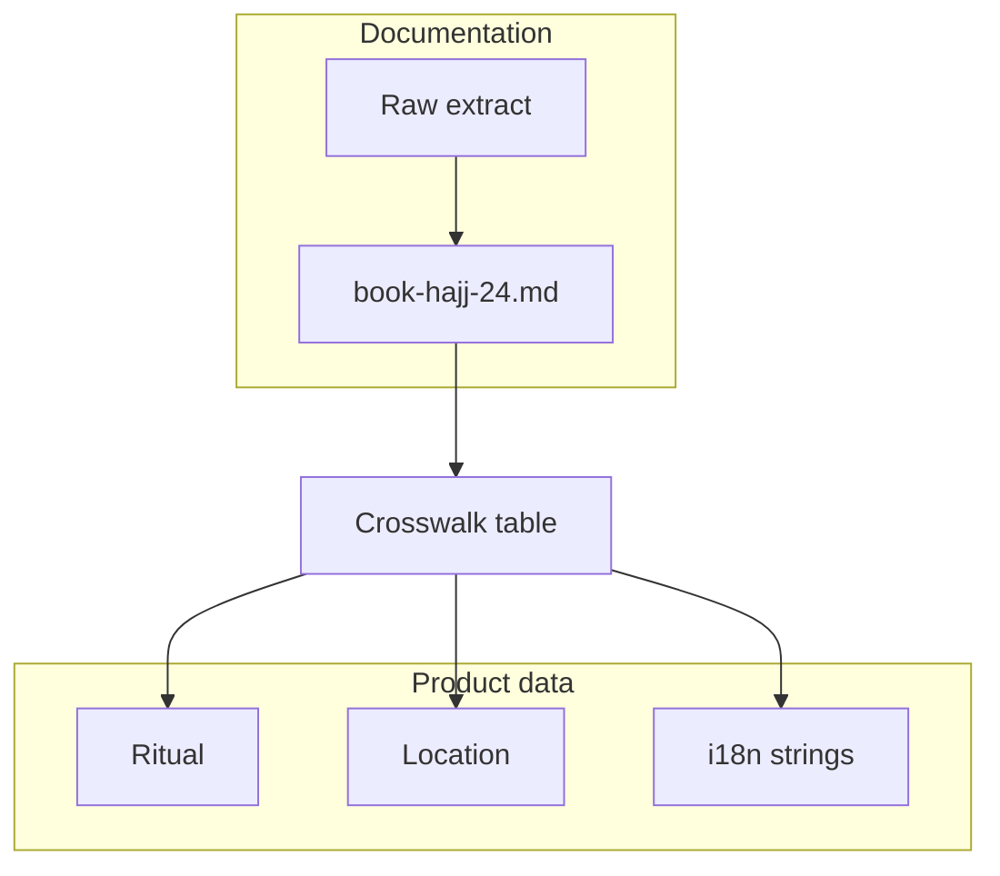

# Book Hajj 24 — booklet reference

This section documents **Book Hajj 24** (`Book Hajj 24 pdf25_compressed.pdf`), a short Hajj guide used as reference material for HajjBro content, rituals, and UX copy.

## Source

| Field | Value |
|--------|--------|
| **Working title** | Book Hajj 24 (compressed PDF) |
| **Pages** | 25 |
| **Notable contact on cover** | `00966536842365` (Saudi Arabia country code `966`) |
| **Language** | Bengali (Bangla) — Islamic terminology and hadith citations appear throughout |

The PDF may live outside the repo (e.g. Cursor workspace storage). Keep a canonical copy for your team if you rely on it for translations or legal review.

## Extraction status

Text was extracted with a standard PDF library (`pypdf`). **Most Bangla text appears as mojibake** (wrong characters) because glyphs are embedded or encoded in a way that does not map cleanly to Unicode. The extract is still useful for:

- Page boundaries and repeated running footers on each page (see raw extract)
- **Latin digits and list numbering** (e.g. numbered rulings, hadith volume/page refs like `gymwjg-2423`, `eyLvix-1883`)
- **Inferring section boundaries** when combined with the table of contents

For **verbatim Bangla** suitable for the app, plan on one or more of:

1. **Re-typing or copy-paste from a Unicode source** if the same text exists elsewhere.
2. **OCR** (e.g. Tesseract with `ben`) on rendered page images, then manual correction.
3. **Asking the publisher** for an electronic text or font mapping if this is an official booklet.

A full machine extract is stored next to this file as `_extract_book_hajj24_raw.txt` (regenerate with the snippet below).

```bash
pip3 install pypdf
python3 -c "
from pypdf import PdfReader
path = 'PATH/TO/Book Hajj 24 pdf25_compressed.pdf'
r = PdfReader(path)
for i, p in enumerate(r.pages):
    print(f'\\n===== PAGE {i+1} =====\\n')
    print(p.extract_text() or '')
" > docs/_extract_book_hajj24_raw.txt
```

## Structural outline (English)

The **table of contents** in the PDF lists topics with target page numbers. The exported PDF has **25** pages; some TOC entries point beyond page 25 (e.g. 48), which may reflect **original print pagination**, a **longer edition**, or **section numbering**—treat TOC page numbers as **editorial references**, not strict PDF page indices until you reconcile them.

Topics implied by the TOC and body (typical Hajj manual structure—aligned with how HajjBro models **rituals**, **locations**, and **rulings**):

1. **Introduction / method of Hajj** — overview and prerequisites.
2. **General fiqh and etiquette** — `KwZcq cwifvlv I cwiwPwZ`-style material.
3. **Hajj & `Umrah` at a glance** — summary charts or lists.
4. **Ihrām** — intention, miqāt, prohibitions, combined with `Umrah` / Hajj where relevant.
5. **Standing at `Arafah` (`Wuquf`)** — rulings and practical notes.
6. **Muzdalifah** — overnight stay, combined rulings.
7. **Beginning `Wuquf`** — timing and validity.
8. **`Tawāf` and `Sa‘y`** — `Ka‘bah` and Ṣafā/Marwah; detailed rulings.
9. **How to perform `Sa‘y`** — step-by-step.
10. **`Ḥaram` boundary / `miqāt`** — entry points and `ḥukm` of crossing.
11. **Virtues of Hajj** — spiritual and textual (`gymwjg` / `eyLvix` style citations).
12. **Virtues of Minā** — staying, rituals, and adab.
13. **Adab in Minā** — behaviour and mistakes to avoid.
14. **Practical notes on Jamārāt / stoning** — routes, crowding, errors (`wiqvRyj` / place names appear in extract).
15. **Women’s issues** — iḥrām, menstruation, concealment, companionship, stoning, `ṭawāf` / `sa‘y` (sections map to women-specific fiqh blocks in the raw text).
16. **Maps / schematic locations** — `yÔAv Key‡ji` / place-name blocks.
17. **Daily routine in Makkah** — tawāf, resting, movement between sites.
18. **Departure, farewell ṭawāf**, and **mistakes** — closing the journey.
19. **Official / organizational appendix** — lists that match `mvwfm©mg~n` / contact-style blocks in the extract.

This outline is **for navigation and product planning**, not a certified fatwā summary. Verify all rulings with qualified scholars for your audience.

## Depiction plan — how to present this section

Use a **layered** model so the booklet stays maintainable as HajjBro grows.

### 1. Documentation layer (this repo)

| Layer | Purpose |
|--------|--------|
| **`docs/book-hajj-24.md` (this file)** | Source metadata, extraction limits, English outline, depiction plan. |
| **`docs/_extract_book_hajj24_raw.txt`** | Frozen machine extract for diffing when the PDF is updated. |
| **Future: `docs/book-hajj-24/`** | Optional subpages: `toc.md`, `women-rulings-notes.md`, `mina-arafat-notes.md` once you have clean Bangla or English. |

### 2. Alignment with HajjBro domain

Map booklet sections to existing concepts (see `README.md` and `prisma/schema.prisma`):

- **Ritual** — ihrām, ṭawāf, sa‘y, wuquf, ramy, etc.
- **Location** — Makkah, Minā, ‘Arafāt, Muzdalifah, Madīnah.
- **Dua / Checklist** — seed content and in-app checklists.

Keep a small **crosswalk table** (in code comments or a future `docs/book-hajj-24-crosswalk.csv`) when you translate: `booklet section → ritualId / locationId`.

### 3. In-app depiction (when you surface this content)

Implemented in the **Ionic app** (`ionic/`): route **`/app/guide`** — “Book Hajj 24” screen with expandable English sections (`ionic/src/data/bookHajj24.ts`), source note, and chips to related rituals. Home includes a **Hajj guide** card and **Hajj Guide** quick action.

- **Per-ritual screen** (future): “Learn more” can pull **paragraph IDs** tied to this booklet after you segment clean text.
- **Language**: store **BN** strings in your i18n layer when you add Bangla; avoid embedding garbled PDF extract in production UI.

### 4. Visual hierarchy (suggested)



## Changelog

| Date | Note |
|------|------|
| 2026-03-28 | Initial section: metadata, outline, depiction plan, raw extract path. |
